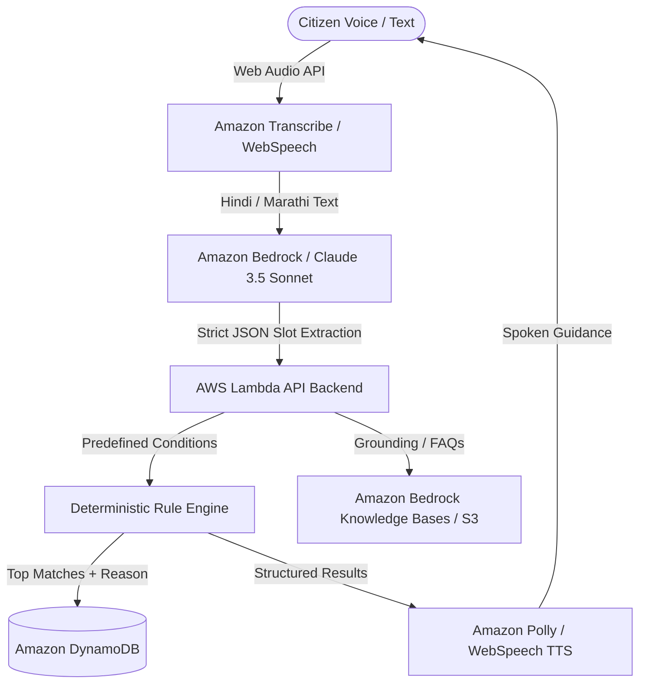

# VoiceScheme AI (योजनामित्र) — Prototype

**AI-Powered Voice-First Government Scheme Finder**  
*Built for AWS College Hackathon & Citizen Tech Innovation*  
*Voice-first • Marathi + Hindi + English • Multi-Scheme Discovery • Deterministic Rule Engine*

---

## 🌟 Key Innovations & Value Proposition

1. **Voice-First & Low Digital Literacy Native**:
   - Citizens simply speak their situation in **Marathi (मराठी)**, **Hindi (हिंदी)**, or **English**.
   - No typing or legal jargon needed.
   - Built with Web Speech Recognition & Speech Synthesis (simulating Amazon Transcribe & Amazon Polly).

2. **Zero Hallucination — Deterministic Rule Engine (TRD Section 6 & PRD Section 8.1)**:
   - *"LLM for language, deterministic rules for decisions."*
   - Predefined official criteria (Age, Gender, State, Income, Land Ownership, Social Category, Occupation) are evaluated strictly through code.
   - Every result is explainable with a line-by-line **"Why you qualify"** trace.

3. **Personalized Document Readiness & Rescue Guide (PRD F9 & TRD Standout)**:
   - Does not just stop at scheme discovery: tells citizens **exactly which documents they have and which are missing**.
   - For every missing document, provides the issuing authority (e.g. Tehsildar, Aaple Sarkar, Talathi), processing time, official fees, and direct portal links.
   - Integrated **"Near Me" Common Service Center (CSC)** & Aaple Sarkar Kendra locator.

4. **15+ Curated Verified Central & Maharashtra State Schemes**:
   - PM-KISAN, Namo Shetkari Mahasanman Nidhi, Majhi Ladki Bahin Yojana, Ayushman Bharat PM-JAY, PMAY-Gramin, Sanjay Gandhi Niradhar Anudan, Shravanbal Seva Rajya Nivruttivetan, Post-Matric Scholarship (MahaDBT), PM Mudra, PM Vishwakarma, APY, PMSBY, PMJJBY, Sukanya Samriddhi, Bal Sangopan.
   - Verified official URLs and last-verified audit dates.

5. **DPDP Act 2023 Compliant**:
   - Zero storage of raw Aadhaar numbers or bank credentials in the discovery session.

---

## 🏗️ AWS Cloud Architecture (TRD Section 8, 9, 10)



---

## 🚀 Running the Prototype Locally

To preview the prototype in any browser:

```bash
cd /Users/avinash252007/.gemini/antigravity-ide/scratch/voicescheme-ai
npx -y serve . -l 3000
```
Open `http://localhost:3000` in your web browser (Chrome, Edge, or Safari).

---

## 👥 Demo Test Personas (TRD & PRD Section 5)

| Persona | Language | Profile | Expected Matches |
| :--- | :--- | :--- | :--- |
| **Sunita (सुनीता)** | Marathi | 52, Farmer's Wife, Raigad, Income: ₹80,000, 7/12 Land Owner | **Mukhyamantri Majhi Ladki Bahin** (₹1,500/mo), **PM-KISAN** (₹6,000/yr), **Namo Shetkari** (₹6,000/yr), **Ayushman Bharat** (₹5L health cover) |
| **Ramesh (रमेश)** | Hindi | 38, Daily-wage construction worker, Pune, Income: ₹1,20,000 | **PMAY-Gramin** (₹1.20L housing aid), **PMSBY** (₹2L accident cover @ ₹20/yr), **PMJJBY** (₹2L life cover) |
| **Aarti (आरती)** | English/Hindi | 19, Student, Kolhapur, SC Category, Income: ₹1,50,000 | **Post-Matric Scholarship (MahaDBT)** (100% Tuition Fee + Maintenance Allowance) |
| **Ganesh (गणेश)** | Marathi/Hindi | 63, Tea stall / Micro-enterprise, Nashik, Income: ₹90,000 | **Shravanbal Seva Rajya Nivruttivetan** (₹1,500/mo senior pension), **PM Mudra Yojana** (Collateral-free loan), **PM Vishwakarma** |

---

## 📂 Project Structure

```
voicescheme-ai/
├── index.html            # Semantic HTML5 app with native dialogs and accessibility
├── index.css             # Rich civic design system (Navy/Saffron/Teal, glassmorphism, print CSS)
├── schemes-data.js       # 15+ verified schemes, document rescue guide, personas, CSC list
├── rule-engine.js        # Pure deterministic eligibility & recommendation ranking engine
├── dialogue-manager.js   # Slot extractor & missing info conversational manager
├── voice-service.js      # Multilingual speech recognition & text-to-speech audio service
├── app.js                # Application coordinator & state manager
├── package.json          # Node script runner
└── README.md             # Project documentation & AWS TRD architecture
```
